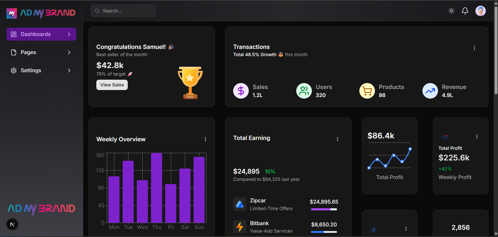

# ADmyBrand Dashboard UI

A responsive admin dashboard built using **React**, **MUI**, **ShadCN UI**, and **TailwindCSS**. Includes charts, skeleton loaders, dark mode toggle, and modular component architecture.

## 🛠️ Tech Stack

- **React** with Vite / Next.js
- **MUI** – Grid layout & responsive design
- **ShadCN UI** – Custom UI components
- **Tailwind CSS** – Utility-first styling
- **Lucide Icons** – Icon library

## 📸 Screenshots


(./public/images/ui/light-ui.png)
(./public/images/ui/light-ui2.png)

## ✨ Features

- Responsive layout (mobile to desktop)
- Dark mode toggle
- Reusable card components
- Charts with placeholder data
- Sidebar navigation with drawer in mobile
- Filter, Pagination, Search, Export Features


## 🚀 Getting Started

### 1. Clone the Repository
```bash
git clone https://github.com/SamuelMasih777/admybrand.git
cd admybrand

npm install
# or
yarn install

npm run dev

npm run build


## 🙏 Credits

- [ShadCN UI](https://ui.shadcn.dev/)
- [MUI](https://mui.com/)
- [Lucide Icons](https://lucide.dev/)

